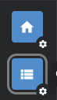

# Setup Environment

### Task.dev CLI

This is a replacement for make, it provides a much simpler syntax and is well documented.

You can read the task.dev documentation [here](https://taskfile.dev/usage/)

##### OSX

```shell
brew install go-task
```

##### Snap

```shell
sudo snap install task --classic
```

##### NPM

```shell
npm install -g @go-task/cli
```

##### Go Install
```shell
go install github.com/go-task/task/v3/cmd/task@latest
```

!!! info

    You can run `task` on your command line to view a list of available tasks and their descriptions.

### Initial Setup Task

Once task is installed run 

```shell
task setup
```

This will create a .env file in the root of the project, install the tilt cli and install the K3D cli.

!!! info

    Please see the [Environment File](#environment-file) section below for information about setting up your .env file correctly.

!!! note

    Tilt is not used by this project but is used by applications that use this toolkit for development.

### Host Names

In order to make ingress work you will need to add some records to your hosts file, we will be adding two
entries. One is for talking to the ingress and the other is for hosting local docker images.

Start by editing your host file typically found at `/etc/hosts`.

Add these two records and set the ip address to `127.0.0.1` if you are running kubernetes locally, alternatively if you
are running kube on a separate machine you can use that machines ip address.

```text
127.0.0.1 dev.cluster.local
127.0.0.1 k3d-local-registry
```

!!! note

    If you are hosting kube on a separate machine you will need to add that machines ip address to the `cluster.yaml` file
    located in `deployment/k3d/cluster.yaml` 

    In here look for the section starting with:
    ```yaml
      k3s:
        extraArgs:
    ```
    And add another entry like:
    ```yaml
      - arg: --tls-san=127.0.0.1
        nodeFilters:
            - server:*
    ```

### Environment File

Edit the `.env` file in the root of the project and update the values

Set your `NAMESPACE` to a value such as `<YOUR FIRST NAME>-dev` you must make sure that the same value is set in
the projects you are working on.

Set your `GHCR_DOCKER_TOKEN` to your GitHub personal access token, this is required to allow kubernetes to pull down docker
images from private repositories.

!!! warning

    You must set the same value for `NAMESPACE` in all projects in order for applications to be deployed into the same
    namespace.

### Create your cluster

To create your cluster run:

```shell
task k3d:create
```

!!! note

    You can later run `task k3d:stop` to stop the cluster and `task k3d:start` to bring it back up without loosing your 
    state, if you want to rebuild your cluster you can run `task k3d:delete` and then repeat the steps outlined in this step
    to re-create your cluster.

Once the above task has completed you should use [lens](https://k8slens.dev/) or [kubectl](https://kubernetes.io/docs/tasks/tools/)
in order to first verify your server is up and running before continuing to the next step.

!!! info

    Lens provide a free developer licence once you sign up.

    When you open Lens you will see an icon at the top left of the app:

    
    
    Click on the catalogue icon (highlighted) and you should see a list of available servers that you can connect to, find
    the one called k3d-dev-1 and click on the little pin to add it to your hot bar. You can now click on that icon to
    begin browsing your local server.

Try running the below commands if you are using `kubectl`:
```shell
kubectl get nodes

# should output
NAME                 STATUS   ROLES                  AGE     VERSION
k3d-dev-1-agent-0    Ready    <none>                 3h36m   v1.24.13+k3s1
k3d-dev-1-server-0   Ready    control-plane,master   3h36m   v1.24.13+k3s1

kubectl get pods -n kube-system

# should output
NAME                                      READY   STATUS    RESTARTS   AGE
coredns-74448699cf-7d8xb                  1/1     Running   0          3h37m
local-path-provisioner-597bc7dccd-vctm2   1/1     Running   0          3h37m
svclb-traefik-5ddc759c-wjk27              2/2     Running   0          3h37m
svclb-traefik-5ddc759c-mcwts              2/2     Running   0          3h37m
traefik-64b96ccbcd-mcnrm                  1/1     Running   0          3h37m
metrics-server-667586758d-2vv6x           1/1     Running   0          3h37m
```

### Install Dependencies

Finally Run 

```shell
task k3d:install:charts
```

to install [Keydb](https://docs.keydb.dev/), [Mongo](https://www.mongodb.com/docs/), [Nats](https://docs.nats.io/) and
the [Verathread Gateway](https://gateway-docs.cloud.azarc.dev/) this will deploy the helm charts for you, 
you can later run `task k3d:delete:charts` to uninstall them if you wish.

### You are good to go

Great you are now ready to switch to your project and start working, check the documentation in each project for instruction
on how to get up and running.
